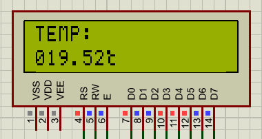

功能概述：

可以测量温度，并使用串口连接计算机，然后可以选择将温度与时间写入数据库，也可以将其发送至QQ上。

原理：

1.使用热电偶测量温度，然后使用运算放大器放大测量信号。

2.通过12位ADC将电压转化为数字信号，通过SPI总线发送至89C51单片机。

3.在单片机内部进行处理，将其显示在LCD1602上，并通过串口发送至计算机（可使用串口转USB芯片，如CH340等，可以使用IO模拟的方式来实现USB的低速模式，但是低速模式需要12M，那么51的频率要达到30M，难度较大且协议复杂度和对时序的要求较高）。

3.用C语言读取串口。

4.用Golang写网络层应用。

电路图如图所示。

由于电源具有波动性，所以应该添加稳压模块。

分别使用7805,7812,7905,7912加滤波电容，输出+-12V，+-5V电压。由于MAX1241电流较小（\<1mA），所以可以添加稳压二极管进行稳压。

放大模块采用了OPA227，高精度、低噪声，差分输入的形式可以有效降低干扰提高系统灵敏度。

The OPAx22x series operational amplifiers combine low noise and wide bandwidth
with high precision to make them the ideal choice for applications requiring
both AC and precision DC performance.

The OPAx227 is unity-gain stable and features high slew rate (2.3V/µs) and wide
bandwidth (8MHz). The OPAx228 is optimized for closed-loop gains of 5 or
greater, and offers higher speed with a slew rate of 10V/µs and a bandwidth of
33MHz.

The OPAx227 and OPAx228 series operational amplifiers are ideal for professional
audio equipment. In addition, low quiescent current and low cost make them ideal
for portable applications requiring high precision.

The OPAx227 and OPAx228 series operational amplifiers are pin-for-pin
replacements for the industry standard OP-27 and OP-37 with substantial
improvements across the board. The dual and quad versions are available for
space savings and per channel cost reduction.

温度/电压关系（电压单位V，温度单位℃）

| 温度 | 0    | 5    | 10   | 15   | 20    | 25   | 30   | 35   | 40   | 45   | 50   | 55   | 60   |
|------|------|------|------|------|-------|------|------|------|------|------|------|------|------|
| 电压 | 0.00 | 0.20 | 0.40 | 0.60 | 0.80  | 1.00 | 1.20 | 1.41 | 1.61 | 1.82 | 2.02 | 2.23 | 2.44 |
| 温度 | 65   | 70   | 75   | 80   | 85.00 | 90   | 95   | 100  | 105  | 110  | 115  | 120  | 125  |
| 电压 | 2.65 | 2.85 | 3.06 | 3.27 | 3.48  | 3.69 | 3.89 | 4.10 | 4.31 | 4.51 | 4.72 | 4.92 | 5.13 |

[CHART]进行线性拟合，得回归直线y=24.281x+0.5731。

AD转换模块采用了MAX1241，低功耗、12位串行ADC。

The MAX1240/MAX1241 low-power, 12-bit analog-to-digital converters (ADCs) are
available in 8-pin packages. The MAX1240 operates with a single +2.7V to +3.6V
supply, and the MAX1241 operates with a single +2.7V to +5.25V supply. Both
devices feature a 7.5µs successive-approximation ADC, a fast track/hold (1.5µs),
an on-chip clock, and a high-speed, 3-wire serial interface.  
Power consumption is only 37mW (VDD = 3V) at the 73ksps maximum sampling speed.
A 2µA shutdown mode reduces power at slower throughput rates.  
The MAX1240 has an internal 2.5V reference, while the MAX1241 requires an
external reference. The MAX1241 accepts signals from 0V to VREF, and the
reference input range includes the positive supply rail. An external clock
accesses data from the 3-wire interface, which connects directly to standard
microcontroller I/O ports. The interface is compatible with SPI™, QSPI™, and
MICROWIRE™.

时序图

Output Coding and Transfer Function

The data output from the MAX1240/MAX1241 is binary, and Figure 10 depicts the
nominal transfer function. Code transitions occur halfway between
successiveinteger LSB values. If VREF = +2.500V, then 1 LSB = 610µV or
2.500V/4096.

此处VREF=+5V，所以1LSB=5V/4096

| CODE | 0    | 164  | 328  | 492  | 655  | 819  | 983  | 1155  | 1319  | 1491  | 1655  | 1827  | 1999  |
|------|------|------|------|------|------|------|------|-------|-------|-------|-------|-------|-------|
| 显示 | 0    | 500  | 1000 | 1500 | 2000 | 2500 | 3000 | 3500  | 4000  | 4500  | 5000  | 5500  | 6000  |
| CODE | 2171 | 2335 | 2507 | 2679 | 2851 | 3023 | 3187 | 3359  | 3531  | 3695  | 3867  | 4030  | 4202  |
| 显示 | 6500 | 7000 | 7500 | 8000 | 8500 | 9000 | 9500 | 10000 | 10500 | 11000 | 11500 | 12000 | 12500 |

拟合得y = 2.9841x

显示部分采用了LCD1602，1602液晶也叫1602字符型液晶，它是一种专门用来显示字母、数字、符号等的点阵型液晶模块。它由若干个5X7或者5X11等点阵字符位组成，每个点阵字符位都可以显示一个字符，每位之间有一个点距的间隔，每行之间也有间隔，起到了字符间距和行间距的作用，正因为如此所以它不能很好地显示图形（用自定义CGRAM，显示效果也不好）。

其控制指令也很简单。

同时，我用C语言写了一个上位程序，可以提供API供其他语言使用。

调用格式为readtemp
COM,返回值为float。因为在Linux下调试单片机不方便，就没有写Linux版本的。一般Linux
kernel自带CH340的驱动，设备节点名称一般为ttyUSB0,对/dev/ttyUSB0进行读写就行了，与windows类似。

我采用了CGO的方式来读写串口。我顺便用COOLQ的HTTPAPI插件，做个一个demo，将温度以post请求的方式发送至API，这样就能借助COOLQ将信息发到QQ上的某个联系人或者群或者讨论组上。因为程序比较简单，也懒得上别的框架了，随便写个post就行了。

插件将QQ上收到的消息以json格式发送到指定的IP的4399端口，并监听5700端口。详见https://richardchien.github.io/coolq-http-api/

程序源码由两个文件组成：

serial.go ：读取串口

server.go ：监听并解析消息

演示截图：

此处设定温度为20度，测得电压为0.8V，SPI debug截取到ADC发送的数据。

，由于热电偶温度电压关系并非线性，所以获取到的度数会有一定的误差，此处为19. 52°

功能测试正常

